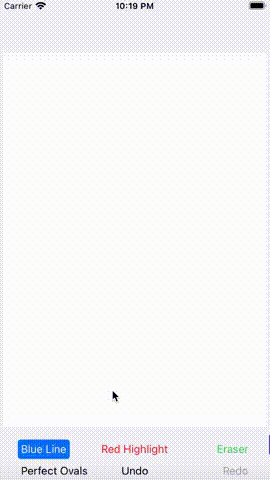
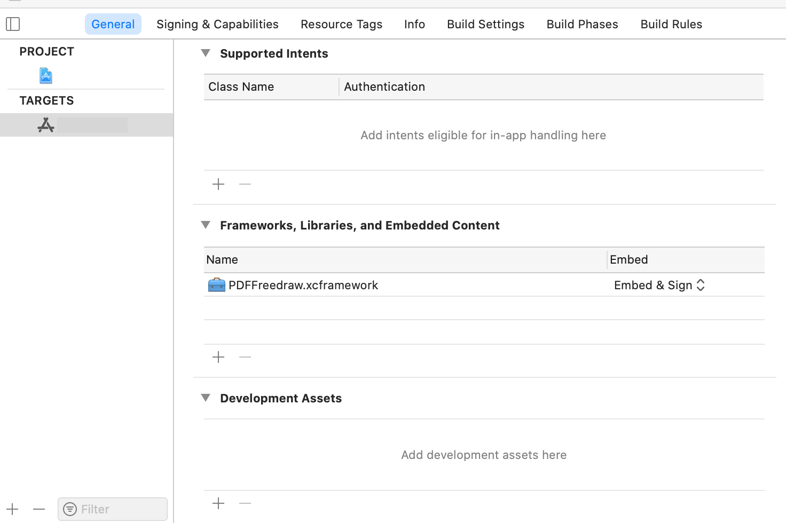

# pdfView Freedraw - Free Draw for iOS and iPadOS PDFKit

  

<code>PDFFreedrawGestureRecognizer</code> is a subclass of <code>UIGestureRecognizer</code>. It allows you to use a pen, a highlighter and an eraser on a <code>PDFView</code> page. It optimizes performance by using a <code>CAShapeLayer</code> for drawing the annotation on screen, and applies an ink-type <code>PDFAnnotation</code> to the page only when touchesEnded is called.

The class includes an undo manager and an eraser that can be used on all types of PDF annotations - including ones not created by the class.

Special features include the ability to snap roughly-drawn ovals into perfect ovals, and a precise eraser for ink-type annotations (rather than just erasing the whole annotation in one go). Please note that non ink-type annotations (stamps, widgets, etc.) are deleted as wholes.

## Requirements
- OS: The demo app can run on iOS or iPadOS 11 or higher. The xcframework can also be used on macOS through catalyst. 
- PDF document loaded through <code>PDFKit</code>.

## Installation
- You can explore the functionality by downloading the entire project and testing the app.
- An xcframework is available at the [release page](https://github.com/ClassicalDude/pdfView-Freedraw/releases). It is compiled for physical devices, simulator and catalyst.
- A swift package of the compiled xcframework is available. To add the package to your project, use the address https://github.com/ClassicalDude/pdfView-Freedraw and enter the branch SPM.
- Using the source code in your project is possible, but can prove tricky because of dependencies, which are pre-compiled into the xcframework. Please refer to [this guide](Compilation.md) if you wish to include the source code in your project.

When manually embedding the xcframework in your project, you must go the General tab of the target's settings and add it to the Frameworks, Libraries and Embedded Content section. Make sure you choose to embed and sign it:

  

After that you can add <code>import PDFFreedraw</code> to the relevant class in your project.

## Usage
Please consult the [ViewController.swift](pdfView%20Freedraw/ViewController.swift) file, which documents all of the options and best practices.
If you plan to use this framework with SwiftUI, you can consult mikekllr's comment [here.](https://github.com/ClassicalDude/pdfView-Freedraw/issues/5#issuecomment-804695681)

## Known Issues
As of iOS14 and iPadOS14, PDFKit does not load saved curved annotation paths properly: all <code>addCurve</code> segments of the path are replaced with <code>addLine</code>. Note that while you are creating annotations everything is working well; the problem manifests when you open a previously-saved file with curved annotations. <code>PDFFreedrawGestureRecognizer</code> has a workaround in place, which stores a json string of the original path in the annotation's <code>"/Content"</code> key of its metadata dictionary, to be recovered automatically by the class' <code>PDFAnnotation.getAnnotationPath() function</code>. See the example [ViewController.swift](pdfView%20Freedraw/ViewController.swift) file for details.

## Credit
The precise eraser for ink-type annotations is made possible by using the [ClippingBezier library](https://github.com/adamwulf/ClippingBezier) from Adam Wulf.
